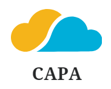
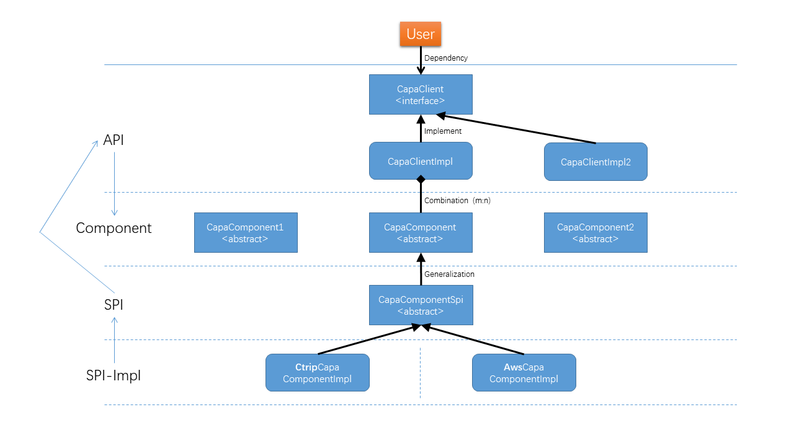

# Capa(cloud application api): To be the high-level api layer for all application runtime.

Let the code achieve "write once, run anywhere".

With the help of the Capa project, your Java applications have the ability to run across clouds and hybrid clouds with small changes.

[中文文档](./README_ZH.md)

## Motivation

### Mecha architecture

The Capa project is based on the design concept of the Mecha architecture and uses **rich SDK mode** to provide Multi-Runtime standard API.

You can simply understand the Capa project as the SDK implementation of [Dapr](https://github.com/dapr/dapr) / [Layotto](https://github.com/mosn/layotto) Sidecar mode projects.

To understand the design ideas of Mecha architecture, please read the following articles:

[死生之地不可不察：论API标准化对Dapr的重要性](https://www.infoq.cn/article/wjkNGoGaaHyKs7xIyTSB)

[MOSN子项目Layotto：开启服务网格+应用运行时新篇章](http://mosn.io/layotto/#/zh/blog/mosn-subproject-layotto-opening-a-new-chapter-in-service-grid-application-runtime/index)

### Sidecar or SDK

Based on the Mecha architecture concept, Multi-Runtime provides standard API functions in a Sidecar manner, which seems to be the most reasonable choice.

So why not use Dapr/Layotto and other projects directly, but choose to develop the Capa project of **Rich SDK Mode** instead.

Summary: _The Sidecar architecture represented by Dapr is the future, but it is difficult for many existing enterprises and systems to upgrade to the Sidecar architecture in one step. The rich SDK architecture will exist for a long time._

Extension: _Faced with the huge Java systems, the Capa project will use the rich SDK model to support the transition from the Java system to the Mecha architecture. After Dapr and other projects mature, they can also be seamlessly connected to the Sidecar architecture._

For specific discussions on this issue, please refer to:

[SDK模型的Dapr API](https://github.com/dapr/dapr/issues/3261)

[Dapr API的未来计划](https://github.com/dapr/dapr/issues/2817)

[Java SDK的设计讨论](https://github.com/mosn/layotto/issues/188)

## Feature

### API definition

Capa API design follow community standards, please refer to the API definitions of open source projects such as Dapr / Layotto.

The API definition is placed in the following independent warehouse, unbound from the Capa project, and hopes to develop into the community's API standard definition:

+ java: [cloud-runtimes-jvm](https://github.com/reactivegroup/cloud-runtimes-jvm)
+ python(alpha): [cloud-runtimes-python](https://github.com/reactivegroup/cloud-runtimes-python)
+ golang(alpha): [cloud-runtimes-golang](https://github.com/reactivegroup/cloud-runtimes-golang)

#### Why not use Dapr API directly?

Due to the current strong binding between Dapr API and Dapr project, we hope that this set of API can become the standard of the entire community, so Capa puts the API definition in an independent warehouse and keeps it synchronized with upstream community standards at all times.

We hope that Dapr can deploy its API independently, decouple it from the Dapr project, and become a standard for the entire community.

For the discussion of this item, please see:

[Future plans for dapr api](https://github.com/dapr/dapr/issues/2817)

### Capa features

Capa (Java SDK) is an SDK solution that implements Mecha architecture for Java applications. It currently supports features in the following areas:

+ Service Invocation (RPC)
+ Configuration Centor (Configuration)
+ Publish/Subscribe (Pub/Sub)
+ State Management (State)
+ Application Log/Metrics/Traces (Telemetry)
+ Database (SQL) -alpha
+ Schedule (Schedule) -alpha
+ ...

## Design

### Capa design

Design idea: **Standard API + pluggable and replaceable SDK components** mode

In different distributed middleware fields, Capa provides a unified standard programming API without relying on specific middleware APIs. Therefore, the application does not need to rely on any specific middleware API when programming with Capa, but only needs to rely on Capa's standard programming API.

When deployed to different target environments, Capa will load different implementation classes of the standard API into the application. When calling a unified programming API, the underlying runtime will be adapted to different specific middleware SDK implementations.

The middleware team needs to develop the implementation classes of the standard API in the target environment for different target environments; and the application code can have a "write once, run anywhere" development experience.

### SDK design

The Capa module is divided into the following parts:

* sdk
* sdk-component
* sdk-spi
* sdk-spi-demo/...



Application programming only needs to rely on the SDK, and use the unified programming API defined in the SDK module.

Before running, the specific SPI implementation package will be introduced as a specific implementation of the unified programming API.

## Usage

### Getting Started

#### Importing Capa's Java SDK

For a Maven project, add the following to your pom.xml file:

```xml

<project>
    ...
    <dependencies>
        ...
        <!-- Capa's core SDK with all features. -->
        <dependency>
            <groupId>group.rxcloud</groupId>
            <artifactId>capa-sdk</artifactId>
            <version>1.0.6.RELEASE</version>
        </dependency>
        ...
    </dependencies>
    ...
</project>
```

Sample implementation library:

```xml

<project>
    ...
    <dependencies>
        ...
        <!-- Capa's core SDK with all features. -->
        <dependency>
            <groupId>group.rxcloud</groupId>
            <artifactId>capa-sdk-spi-demo</artifactId>
            <version>1.0.6.RELEASE</version>
        </dependency>
        ...
    </dependencies>
    ...
</project>
```

### Running the examples

Try the following examples to learn more about Capa's Java SDK:

* [capa-demo](https://github.com/reactivegroup/capa/tree/master/sdk-spi-demo)
* [capa-aws](https://github.com/reactivegroup/capa-aws)
* [capa-alibaba](https://github.com/reactivegroup/capa-alibaba)

### Low retrofit cost migration

If you want to use the native Capa API, your legacy system needs to face a large refactoring workload.

In order to make the migration low-cost, we can reuse the middleware API currently used.

By developing an adaptation layer project (providing the same annotation/interface call method), the implementation of the original middleware API is changed to Capa API.

In this way, the application only needs to change a few code (such as changing the path name of the annotation/interface) to migrate to the Capa architecture.

For discussion of this issue, please see:

[Java sdk design 调研：能否复用业界已有的事实标准](https://github.com/mosn/layotto/issues/206)

[Capa API adapted to spring annotation.](https://github.com/reactivegroup/sigs/issues/16)

[遗留中间件SDK无感迁移到Capa.](https://github.com/reactivegroup/sigs/issues/18)

## Develop

#### Reactor API

Taking into account the asynchronous call mode and the use of non-blocking IO, we provide the Reactor programming model natively. You can also use the synchronous call function through its `block()` method.

The Java SDK for Capa is built using [Project Reactor](https://projectreactor.io/). It provides an asynchronous API for
Java. When consuming a result is consumed synchronously, as in the examples referenced above, the `block()` method is
used.

The code below does not make any API call, it simply returns
the [Mono](https://projectreactor.io/docs/core/release/api/reactor/core/publisher/Mono.html) publisher object. Nothing
happens until the application subscribes or blocks on the result:

```java
Mono<String> result=capaRpcClient.invokeMethod(SERVICE_APP_ID,"say","hello",HttpExtension.POST,null,TypeRef.STRING);
```

To start execution and receive the result object synchronously, use `block()`. The code below shows how to execute the
call and consume an empty response:

```java
Mono<String> result=capaRpcClient.invokeMethod(SERVICE_APP_ID,"say","hello",HttpExtension.POST,null,TypeRef.STRING);
        String response=result.block();
```

#### Exception handling

Most exceptions thrown from the SDK are instances of `CapaException`. `CapaException` extends from `RuntimeException`,
making it compatible with Project Reactor.

## Future

### Multi-Runtime

[Multi-Runtime 2022：待解决的问题](https://zhuanlan.zhihu.com/p/435012312?utm_source=wechat_session&utm_medium=social&utm_oi=618742049890111488&utm_content=group2_article&utm_campaign=shareopn)
