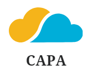
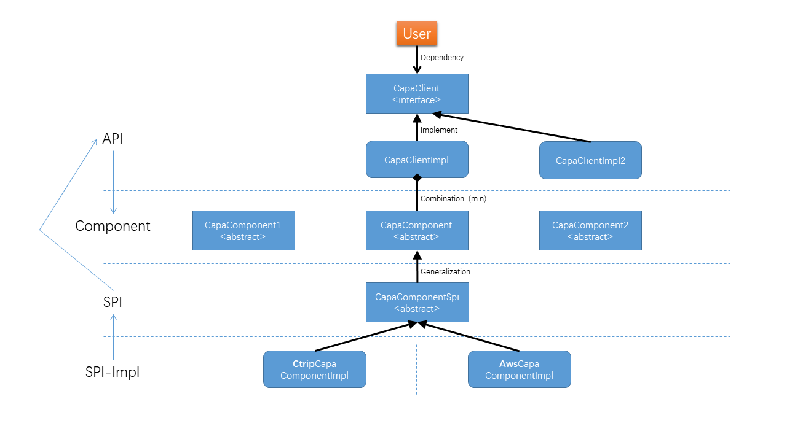

<p align="center">
  
</p>

# Capa Java SDK

Capa is a rich-SDK implementation of Cloud Application APIs for Java. Applications program against vendor-neutral runtime interfaces while pluggable SPI modules connect those interfaces to concrete middleware or cloud services.

[简体中文](README_ZH.md) · [Documentation](https://capa.rxcloud.group/) · [Issues](https://github.com/capa-cloud/capa-java/issues)

> **Project boundary:** this repository contains the Java SDK. The experimental Go sidecar runtime is maintained separately in [capa](https://github.com/capa-cloud/capa), and API contracts are defined in [cloud-runtimes-jvm](https://github.com/capa-cloud/cloud-runtimes-jvm).

## Requirements

- Java 8 or 11
- Maven 3.8.1 or later
- A Capa SPI implementation for every capability used by the application

### Logging compatibility

The Java 8-compatible build pins Logback `1.3.16`. Upstream classifies the
entire Logback 1.3.x line as end-of-life; maintained Logback 1.5.x releases
require Java 11 or later. Applications that use the Capa Logback integration
should choose one of these paths:

- On Java 11 or later, manage `logback-core` and `logback-classic` to `1.5.38`
  or a later compatible 1.5.x release. CI verifies the repository with
  `-Dlogback.version=1.5.38`.
- On Java 8, use the actively maintained Log4j 2 integration where possible,
  or plan a Java 11 migration before accepting untrusted logging
  configuration.

See the [Logback download and support status](https://logback.qos.ch/download.html)
for the current runtime requirements. Do not load logging configuration from
untrusted sources.

## Add the SDK

Current repository version: `1.11.13.2.RELEASE`.

```xml
<dependency>
    <groupId>group.rxcloud</groupId>
    <artifactId>capa-sdk</artifactId>
    <version>1.11.13.2.RELEASE</version>
</dependency>
```

`capa-sdk` exposes the programming surface but does not select production infrastructure on its own. Add a compatible SPI implementation, such as an organization-specific adapter or one of the cloud integration repositories.

For local exploration only, the repository publishes a demo SPI:

```xml
<dependency>
    <groupId>group.rxcloud</groupId>
    <artifactId>capa-sdk-spi-demo</artifactId>
    <version>1.11.13.2.RELEASE</version>
    <scope>runtime</scope>
</dependency>
```

The demo SPI is an example implementation, not a production runtime.

## Capabilities

The SDK and API modules cover these runtime domains:

| Domain | Purpose | Maturity note |
| --- | --- | --- |
| RPC | Service invocation | API and component/SPI layers are present |
| Configuration | Dynamic configuration stores | API and component/SPI layers are present |
| Pub/Sub | Message publication and subscription | API and component/SPI layers are present |
| State | Key-value state operations | API contracts are present; adapter support varies |
| Telemetry | Logs, metrics, and trace context | Component/SPI support is present |
| Database and schedule | Extended runtime APIs | Treat as alpha and verify the selected adapter |

An API contract being present does not guarantee that every SPI adapter implements every operation. Check the adapter repository and run integration tests against the target infrastructure before production use.

## Repository layout

```text
.
├── sdk/                    # Public Capa SDK
├── sdk-component/          # Component discovery and shared implementations
├── sdk-spi/                # SPI extension points
├── sdk-spi-demo/           # Demo SPI implementation
├── sdk-infrastructure/     # Runtime infrastructure and hooks
├── sdk-springboot/         # Spring Boot integration
├── examples/               # Example applications
└── spec/                   # Protocol definitions
```

The design follows **standard APIs plus replaceable SDK components**:

<p align="center">
  
</p>

## Build and verify

```bash
git clone https://github.com/capa-cloud/capa-java.git
cd capa-java
mvn --batch-mode --no-transfer-progress --fail-fast clean verify \
  -Pjacoco,rat,checkstyle \
  -DskipTests=false \
  -Dcheckstyle.skip=false \
  -Drat.skip=false \
  -Dmaven.javadoc.skip=true \
  -Dgpg.skip=true
```

This is the same verification profile used by CI on Java 8 and Java 11.

Runnable and configuration examples are available in [`examples/`](examples/) and [`sdk-spi-demo/`](sdk-spi-demo/). Sample component mappings live under each module's `src/main/resources/sample/` directory.

## Reactive API model

Capa uses [Project Reactor](https://github.com/reactor/reactor-core) for asynchronous operations. A returned [`Mono`](https://github.com/reactor/reactor-core/blob/main/docs/modules/ROOT/pages/coreFeatures/mono.adoc) remains lazy until it is subscribed to or blocked:

```java
Mono<String> result = capaRpcClient.invokeMethod(
    SERVICE_APP_ID,
    "say",
    "hello",
    HttpExtension.POST,
    null,
    TypeRef.STRING
);

String response = result.block();
```

Use non-blocking composition in reactive applications. Call `block()` only at an intentional synchronous boundary.

## Design background

- [Dapr API future plans](https://github.com/dapr/dapr/issues/2817)
- [Layotto Java SDK design discussion](https://github.com/mosn/layotto/issues/188)
- [Adapting Capa APIs to Spring annotations](https://github.com/reactivegroup/sigs/issues/16)
- [Migrating legacy middleware SDKs to Capa](https://github.com/reactivegroup/sigs/issues/18)
- [Multi-Runtime 2022: open questions](https://zhuanlan.zhihu.com/p/435012312)

## Contributing

1. Create a branch from `master`.
2. Keep public API changes compatible or document the compatibility impact.
3. Update examples whenever an SDK or SPI contract changes.
4. Run the full verification command above.
5. Open a pull request with the affected capability and adapter scope.

Do not commit cloud credentials, private endpoints, or customer configuration in examples or test resources.

## License

Apache License 2.0. See [LICENSE](LICENSE).
